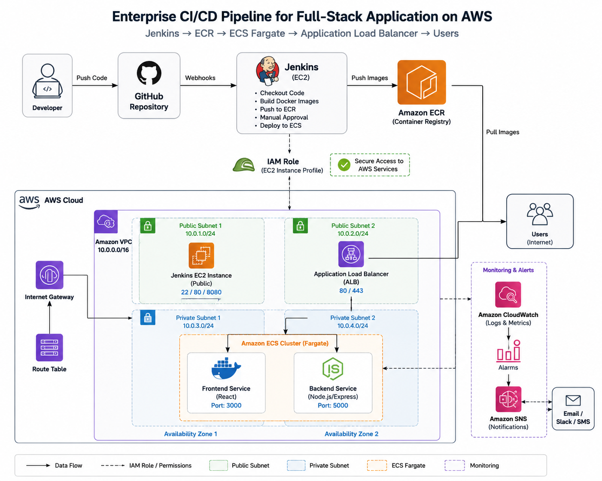

# Jenkins CI/CD Pipeline for Full-Stack Application on AWS


Automated CI/CD platform built with **Jenkins**, **Terraform**, **Docker**, **Amazon ECS Fargate**, **Amazon ECR**, **Application Load Balancer**, and **Amazon CloudWatch**.

## Table of Contents

- [Overview](#overview)
- [Architecture](#architecture)
- [Technology Stack](#technology-stack)
- [Project Objectives](#project-objectives)
- [Repository Structure](#repository-structure)
- [Infrastructure Components](#infrastructure-components)
- [Jenkins CI/CD Pipeline](#jenkins-cicd-pipeline)
- [Security](#security)
- [Monitoring](#monitoring)
- [Project Results](#project-results)
- [Screenshots](#screenshots)
- [Lessons Learned](#lessons-learned)
- [Cleanup](#cleanup)

## Overview

This project demonstrates the design and implementation of an enterprise-style CI/CD platform for deploying a containerized full-stack application on AWS.

The infrastructure was provisioned using Terraform, while Jenkins automated the software delivery pipeline by building Docker images, publishing them to Amazon ECR, and deploying the application to Amazon ECS Fargate. A manual approval stage was included before production deployment to simulate a controlled release process.

To improve security, Jenkins authenticated to AWS using an IAM Role attached to the EC2 instance instead of long-term AWS access keys. Amazon CloudWatch was configured to monitor the deployed environment, and all infrastructure was removed after validation using Terraform to avoid unnecessary cloud costs.

---

## Project Objectives

This project was designed to demonstrate an enterprise DevOps workflow by:

- Automating application deployment with Jenkins.
- Provisioning AWS infrastructure using Terraform.
- Containerizing frontend and backend applications with Docker.
- Publishing container images to Amazon ECR.
- Deploying containers to Amazon ECS Fargate.
- Routing traffic through an Application Load Balancer.
- Implementing a manual approval stage before production deployment.
- Monitoring infrastructure with Amazon CloudWatch.
- Applying IAM security best practices using roles instead of long-term access keys.
- Managing the complete infrastructure lifecycle using Terraform.

---

## Architecture

The solution automates the deployment of a containerized React frontend and Node.js/Express backend using Jenkins and AWS services.

```text
Developer
    │
    ▼
GitHub Repository
    │
    ▼
Jenkins CI/CD Pipeline
    │
    ├── Checkout Source Code
    ├── Verify AWS Identity
    ├── Build Docker Images
    ├── Push Images to Amazon ECR
    ├── Manual Deployment Approval
    └── Deploy to Amazon ECS
                 │
                 ▼
        Amazon ECS Fargate
          ├── Frontend Service
          └── Backend Service
                 │
                 ▼
     Application Load Balancer
                 │
                 ▼
              End Users

Monitoring:
Amazon CloudWatch
```



## Technology Stack

| Category | Technology |
|----------|------------|
| Cloud Platform | AWS |
| Infrastructure as Code | Terraform |
| CI/CD | Jenkins |
| Containers | Docker |
| Container Registry | Amazon ECR |
| Container Orchestration | Amazon ECS Fargate |
| Load Balancing | Application Load Balancer |
| Monitoring | Amazon CloudWatch |
| Notifications | Amazon SNS |
| Identity & Access Management | AWS IAM |
| Networking | Amazon VPC |
| Frontend | React |
| Backend | Node.js / Express |
| Version Control | Git & GitHub |

## Infrastructure Components

| Component | Purpose |
|-----------|---------|
| Amazon VPC | Provides an isolated network for all project resources. |
| Public Subnets | Host the Application Load Balancer and Jenkins EC2 instance. |
| Internet Gateway | Enables internet connectivity for public resources. |
| Security Groups | Control inbound and outbound network traffic. |
| Jenkins EC2 Instance | Executes the CI/CD pipeline and deployment process. |
| IAM Roles | Allow Jenkins to securely interact with AWS services without storing access keys. |
| Amazon ECR | Stores Docker images for the frontend and backend applications. |
| Amazon ECS Fargate | Runs containerized applications without managing EC2 servers. |
| Application Load Balancer | Distributes incoming traffic to ECS services. |
| Amazon CloudWatch | Collects logs, metrics, and monitors infrastructure health. |
| Amazon SNS | Sends notifications for CloudWatch alarms. |
| Terraform | Automates infrastructure provisioning and cleanup. |

### Security Design

This project follows AWS security best practices by:

- Using IAM Roles instead of long-term AWS access keys.
- Applying the principle of least privilege.
- Isolating infrastructure inside a dedicated VPC.
- Restricting inbound traffic using Security Groups.
- Running application containers on Amazon ECS Fargate.
- Managing infrastructure through Infrastructure as Code with Terraform.

---

# Jenkins CI/CD Pipeline

The CI/CD pipeline automates the complete software delivery process from source code to deployment on Amazon ECS Fargate.

## Pipeline Workflow

### 1. Source Code Checkout

- Jenkins pulls the latest source code from the GitHub repository.
- Both frontend and backend applications are retrieved for the build process.

---

### 2. Verify AWS Identity

The pipeline verifies that Jenkins is authenticated using the attached IAM Role before interacting with AWS resources.

Command executed:

```bash
aws sts get-caller-identity
```

---

### 3. Build Docker Images

Docker images are built separately for the frontend and backend applications.

Frontend

```bash
docker build -t frontend ./frontend
```

Backend

```bash
docker build -t backend ./backend
```

---

### 4. Push Images to Amazon ECR

The Docker images are tagged and pushed to Amazon Elastic Container Registry.

This provides a centralized and secure container image repository for deployment.

---

### 5. Manual Approval

Before production deployment, Jenkins pauses the pipeline for manual approval.

This simulates a controlled enterprise release process where production deployments require authorization.

---

### 6. Deploy to Amazon ECS Fargate

Once approved, Jenkins updates the ECS services using the newly pushed Docker images.

Amazon ECS automatically launches new tasks and replaces the old containers.

---

### 7. Traffic Routing

The Application Load Balancer routes incoming traffic to healthy ECS tasks.

Health checks ensure only healthy containers receive requests.

---

### 8. Monitoring

Amazon CloudWatch monitors:

- ECS services
- Application Load Balancer
- Infrastructure health
- CloudWatch Alarms
- Amazon SNS Notifications

---

# Security

Security was implemented throughout the project by following AWS best practices.

- IAM Roles were used instead of storing AWS access keys on the Jenkins server.
- Least privilege permissions were applied wherever possible.
- Security Groups restricted inbound access.
- Docker images were stored securely in Amazon ECR.
- Infrastructure was deployed and managed using Terraform.
- Production deployment required manual approval before release.

---

# Monitoring

Amazon CloudWatch was configured to monitor the deployed infrastructure.

Monitoring included:

- ECS Service Health
- Application Load Balancer Health
- CloudWatch Alarms
- Amazon SNS Notifications

CloudWatch provides operational visibility and helps detect issues before they affect users.
---

# Project Results

The project successfully demonstrated an end-to-end enterprise CI/CD workflow using Jenkins and AWS.

## Achievements

- Provisioned AWS infrastructure using Terraform.
- Automated application build and deployment with Jenkins.
- Containerized React frontend and Node.js backend using Docker.
- Published Docker images to Amazon ECR.
- Deployed containerized applications on Amazon ECS Fargate.
- Configured an Application Load Balancer for traffic distribution.
- Implemented CloudWatch monitoring and SNS notifications.
- Applied IAM Roles to eliminate the need for long-term AWS credentials.
- Destroyed all cloud resources using Terraform after validation to avoid unnecessary AWS costs.

---

# Lessons Learned

This project strengthened my understanding of building enterprise-grade CI/CD platforms on AWS.

Key lessons learned include:

- Designing infrastructure using Terraform.
- Building reusable Infrastructure as Code.
- Managing Docker images with Amazon ECR.
- Deploying applications using Amazon ECS Fargate.
- Building secure Jenkins pipelines using IAM Roles.
- Implementing monitoring with Amazon CloudWatch.
- Automating the full software delivery lifecycle.
- Following AWS security best practices using least privilege access.

---

# Cleanup

After validating the deployment, all AWS resources were destroyed using Terraform.

```bash
terraform destroy
```

This ensures:

- No unnecessary AWS charges.
- Clean infrastructure lifecycle management.
- Reproducible deployments using Infrastructure as Code.

---

## Author

**Gbemi Adekunle**

Cloud & DevOps Engineer

- LinkedIn: https://www.linkedin.com/in/gbemi-adekunle-272b57419
- GitHub: https://github.com/Gbemi04